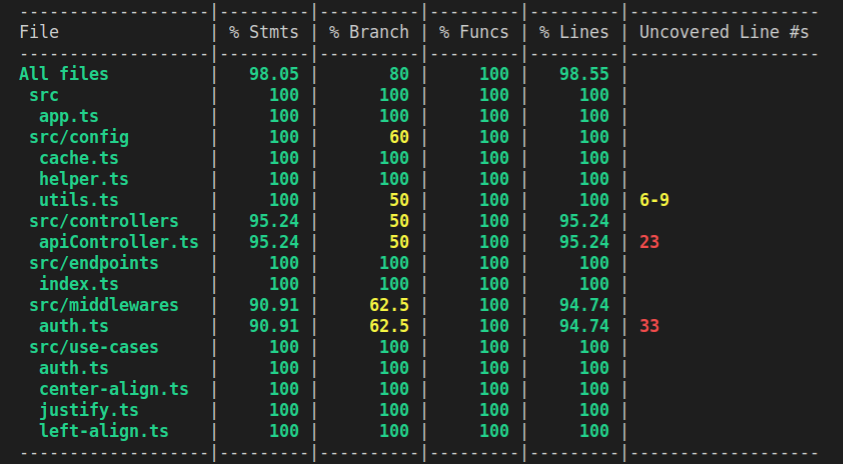

# Text Justification Service 

Service built using [Node](https://docs.docker.com/compose/),  [TypeScript](https://docs.docker.com/compose/) and [Express](http://flask.pocoo.org/)

## INSTRUCTIONS
----

### Installation

```bash
git clone https://github.com/angegnango/justify-text
```

### Install dependencies

```bash
npm install
```

### Launch

```bash
npm start
```

This will expose the service at  `http://localhost:3000` 

---

## Coverage

Coverage are available here 



---

## Endpoints

### Authentication and Authorization

Endpoint : `http://localhost:3000/api/token`\
Method : POST\
Content-Type: application/json\
Payload: { email: useremail@email.com }

---

### Text Justification

Endpoint : `http://localhost:3000/api/justify`\
Method : POST\
Content-Type: text/json\
Payload: { email: useremail@email.com }


---

## Basic Api Docs

Swagger definitions available here  `http://localhost:3000/api/docs` 

